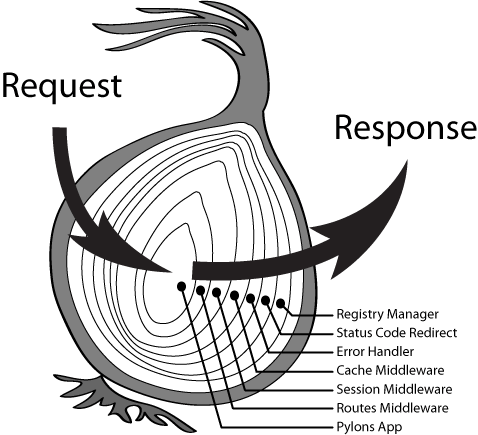

## 洋葱圈模型

Koa 中间件是以级联代码（Cascading） 的方式来执行的。类似于回形针的方式，可参照下面这张图：



```javascript

function * gen1 (next) {
  yield 'gen1'
  yield * next // 开始执行下一个中间件
  yield 'gen1-end' // 下一个中间件执行完成再继续执行gen1中间件的逻辑
}

function * gen2 (next) {
  yield 'gen2'
  yield * next // 开始执行下一个中间件
  yield 'gen2-end' // 下一个中间件执行完成再继续执行gen2中间件的逻辑
}

function * gen3 (next) {
  yield 'gen3'
  yield * next // 开始执行下一个中间件
  yield 'gen3-end' // 下一个中间件执行完成再继续执行gen3中间件的逻辑
}

function * noop () {}

var middleware = [gen1, gen2, gen3]
var len = middleware.length
var next = noop() // 提供给最后一个中间件的参数

while(len--) {
  next = middleware[len].call(null, next)
}

function * letGo (next) {
  yield * next
}

var g = letGo(next)

g.next() // {value: "gen1", done: false}
g.next() // {value: "gen2", done: false}
g.next() // {value: "gen3", done: false}
g.next() // {value: "gen3-end", done: false}
g.next() // {value: "gen2-end", done: false}
g.next() // {value: "gen1-end", done: false}
g.next() // {value: undefined, done: true}

```